# 📊 FileManager Pro - Architecture Diagrams

  
  
  

## 📋 Table of Contents

- [System Architecture](#system-architecture)
- [Database Schema](#database-schema)
- [Application Flow](#application-flow)
- [Security Architecture](#security-architecture)
- [Deployment Architecture](#deployment-architecture)
- [API Architecture](#api-architecture)
- [File Processing Flow](#file-processing-flow)
- [User Journey](#user-journey)

## 🏗️ System Architecture

### Overall System Architecture
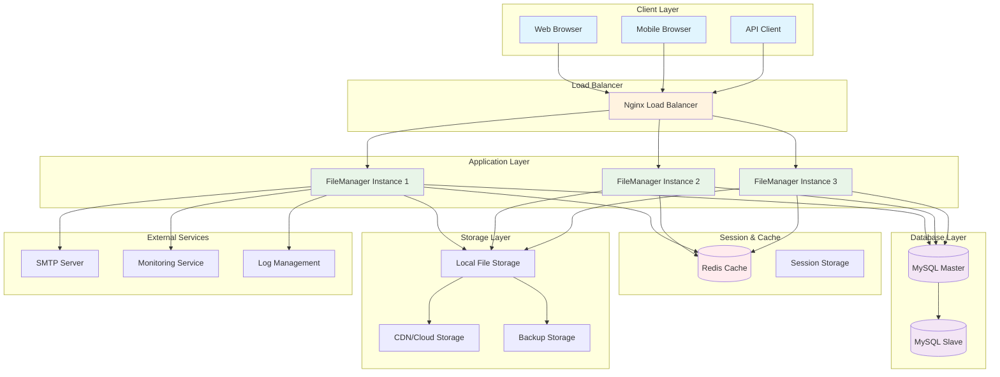

### Component Architecture
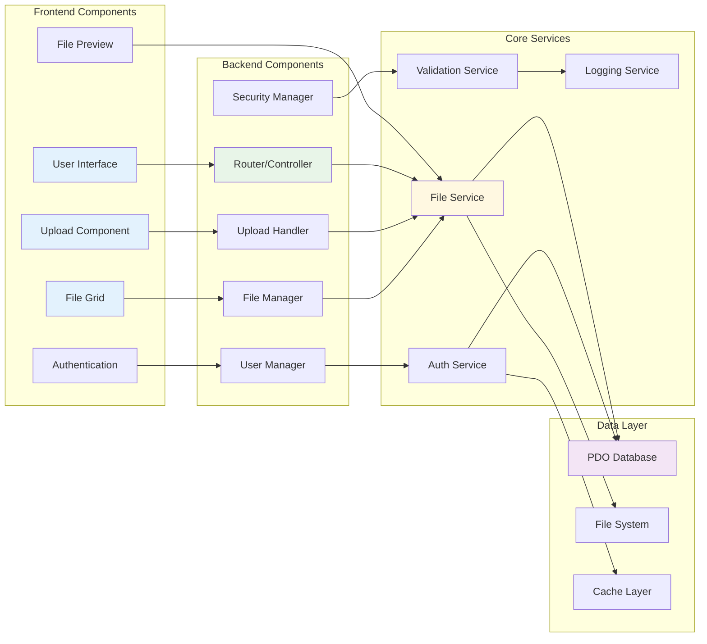

## 🗄️ Database Schema

### Entity Relationship Diagram
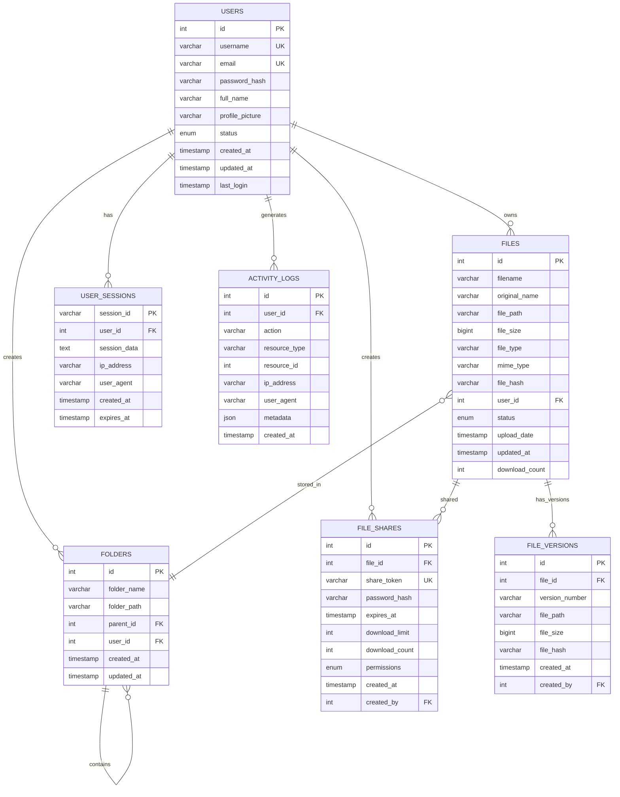

### Database Indexes and Performance
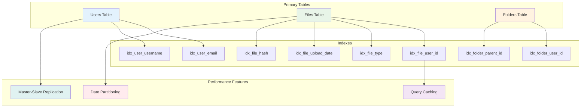

## 🔄 Application Flow

### File Upload Flow
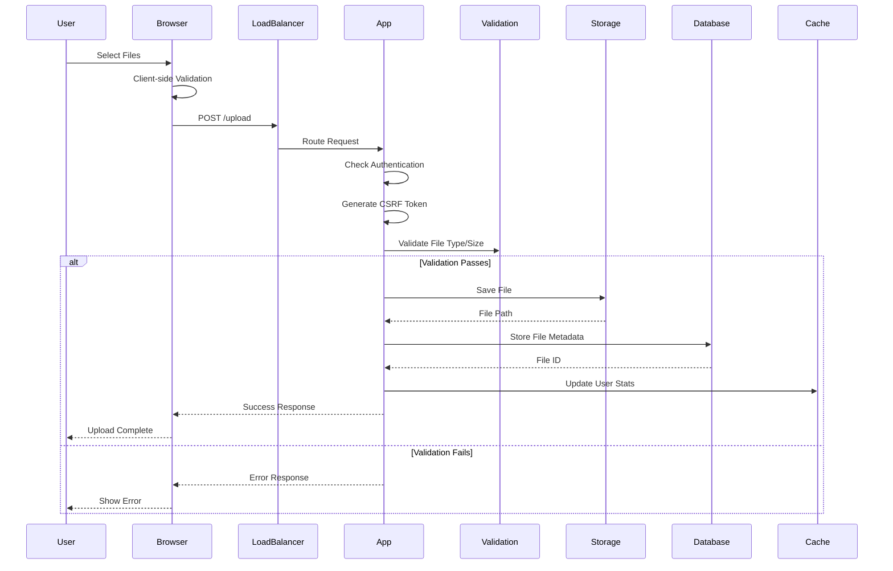

### User Authentication Flow
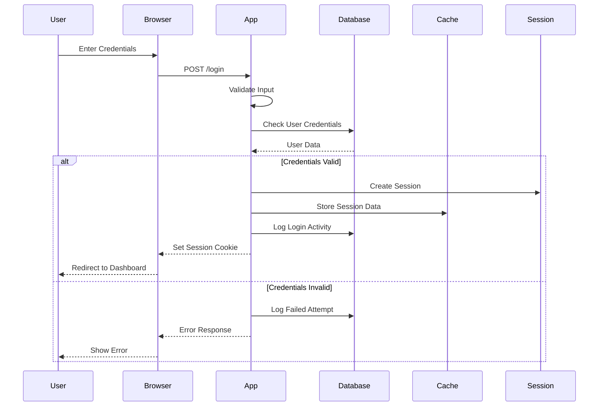

### File Management Operations
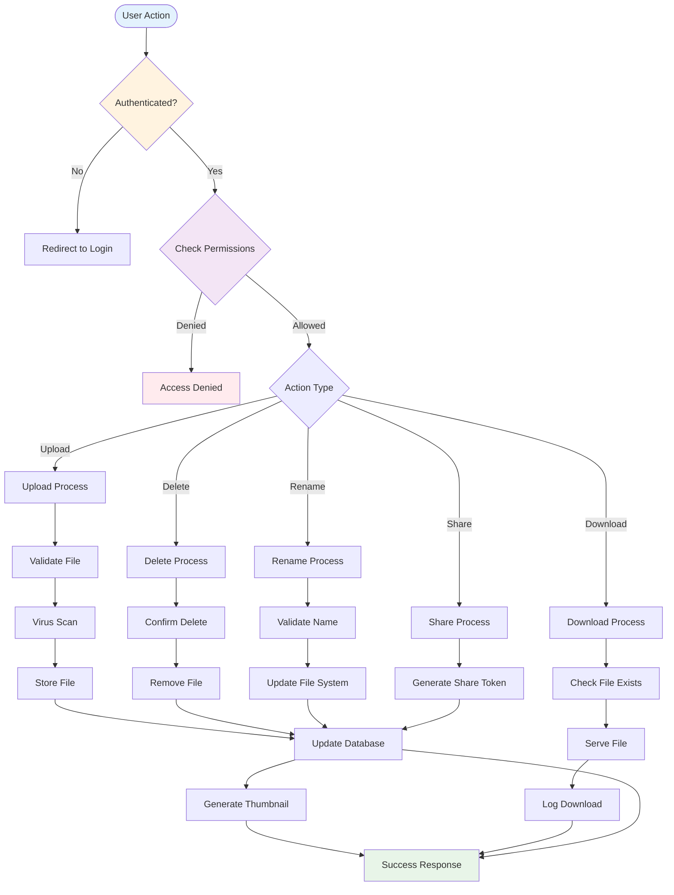

## 🔒 Security Architecture

### Security Layers
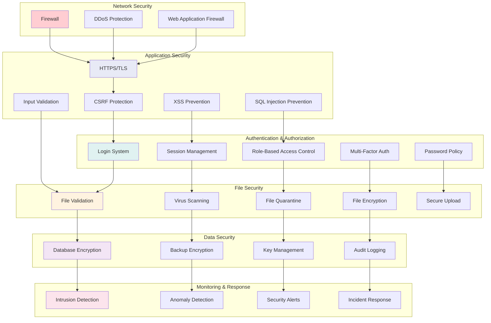

### Authentication Flow
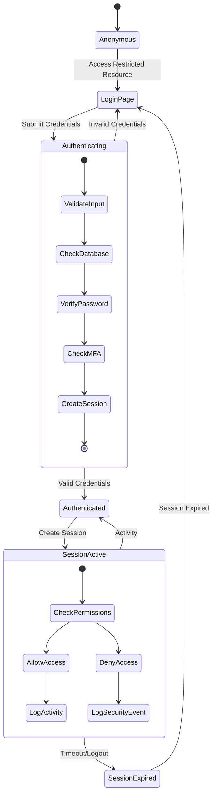

## 🚀 Deployment Architecture

### Production Deployment
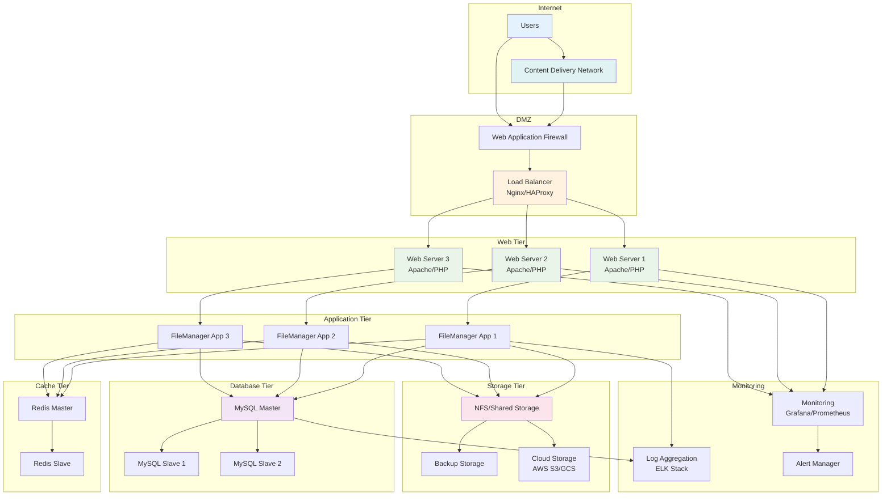

### Docker Deployment Architecture
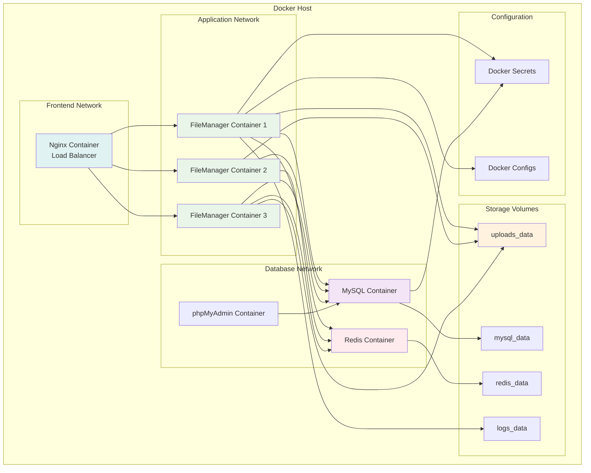

## 🔌 API Architecture

### REST API Structure
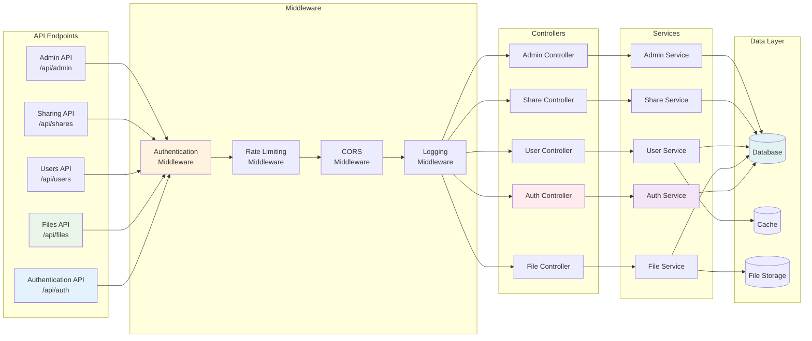

### API Request/Response Flow
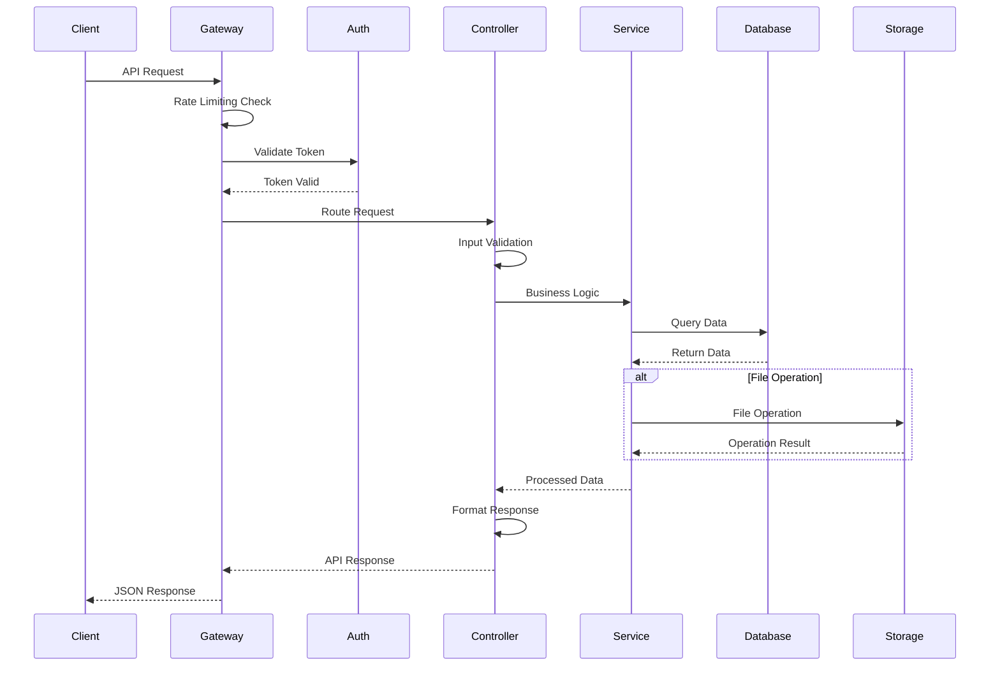

## 📁 File Processing Flow

### File Upload Processing
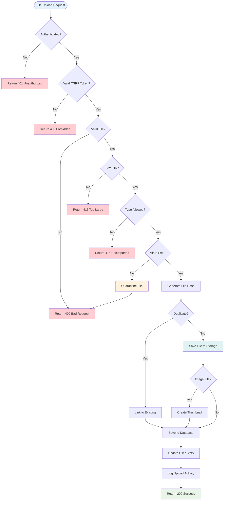

### File Security Scanning
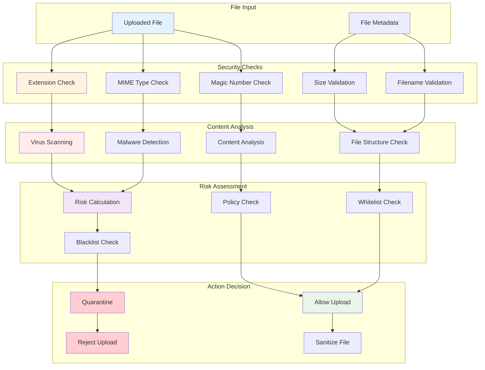

## 👤 User Journey

### User Registration to File Upload
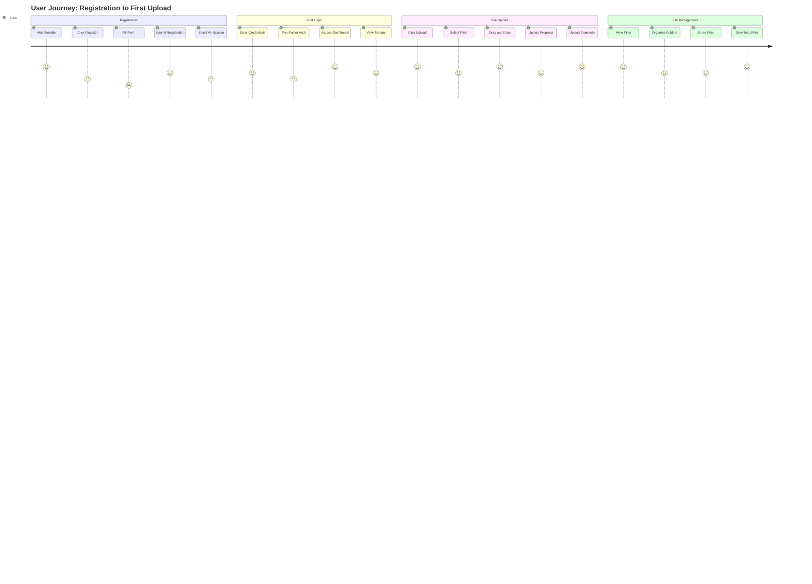

### Admin User Management Flow
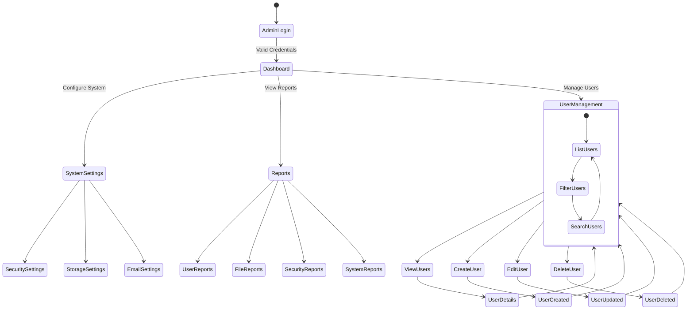

## 📊 Performance Monitoring

### System Performance Dashboard
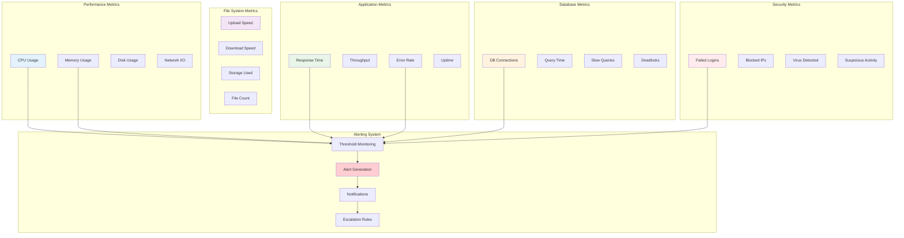

---

## 📝 Diagram Usage Instructions

### Viewing Diagrams
These diagrams use **Mermaid** syntax and can be viewed in:
- GitHub (native support)
- GitLab (native support)
- VS Code (with Mermaid extension)
- Mermaid Live Editor (https://mermaid.live)
- Documentation platforms (GitBook, Notion, etc.)

### Editing Diagrams
To modify any diagram:
1. Copy the Mermaid code
2. Paste into Mermaid Live Editor
3. Make your changes
4. Export or copy the updated code

### Integration
These diagrams can be integrated into:
- Technical documentation
- System design reviews
- Architecture presentations
- Developer onboarding materials
- Stakeholder communications

---

**Built with ❤️ by [whympxx](https://github.com/whympxx)**

*Professional architecture diagrams for modern file management*
