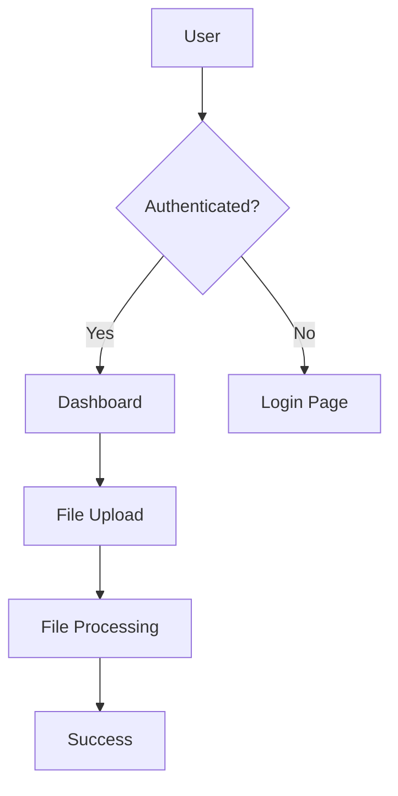

# 📊 FileManager Pro - Complete Diagram Index

<div align="center">
  
  
  
</div>

## 🎯 Overview

This document provides a comprehensive index of all diagrams and visual documentation created for the FileManager Pro application. These diagrams provide complete system visibility from high-level architecture to detailed implementation flows.

## 📋 Diagram Categories

### 🏗️ [Architecture Diagrams](ARCHITECTURE_DIAGRAMS.md)
Interactive Mermaid diagrams for system architecture and design:

| Diagram | Type | Purpose | Complexity |
|---------|------|---------|------------|
| **Overall System Architecture** | Graph | Complete system overview | ⭐⭐⭐⭐⭐ |
| **Component Architecture** | Graph | Application components | ⭐⭐⭐⭐ |
| **Database ERD** | Entity Relationship | Database schema design | ⭐⭐⭐⭐⭐ |
| **Database Performance** | Graph | Indexes and optimization | ⭐⭐⭐ |
| **File Upload Flow** | Sequence | Upload process steps | ⭐⭐⭐⭐ |
| **Authentication Flow** | Sequence | User login process | ⭐⭐⭐ |
| **File Management Operations** | Flowchart | File operations flow | ⭐⭐⭐⭐ |
| **Security Layers** | Graph | Multi-layer security | ⭐⭐⭐⭐⭐ |
| **Authentication States** | State | Auth state machine | ⭐⭐⭐ |
| **Production Deployment** | Graph | Production architecture | ⭐⭐⭐⭐⭐ |
| **Docker Architecture** | Graph | Container deployment | ⭐⭐⭐⭐ |
| **REST API Structure** | Graph | API architecture | ⭐⭐⭐⭐ |
| **API Request/Response** | Sequence | API communication | ⭐⭐⭐ |
| **File Processing Flow** | Flowchart | File upload processing | ⭐⭐⭐⭐⭐ |
| **Security Scanning** | Graph | File security checks | ⭐⭐⭐⭐ |
| **User Journey** | Journey | User experience flow | ⭐⭐⭐ |
| **Admin Workflow** | State | Admin management flow | ⭐⭐⭐ |
| **Performance Dashboard** | Graph | System monitoring | ⭐⭐⭐⭐ |

### 🎨 [Visual Diagrams](VISUAL_DIAGRAMS.md)
ASCII art and visual representations for documentation:

| Diagram | Type | Purpose | Format |
|---------|------|---------|--------|
| **High-Level Architecture** | ASCII | System overview | Text Art |
| **Component Relationships** | ASCII | Component interaction | Text Art |
| **Database Schema** | ASCII | ERD visualization | Text Art |
| **File Upload Workflow** | ASCII | Process flow | Text Art |
| **Security Scanning Process** | ASCII | Security workflow | Text Art |
| **Docker Container Layout** | ASCII | Container architecture | Text Art |
| **API Structure** | ASCII | API visualization | Text Art |
| **User Journey Map** | ASCII | User experience | Text Art |
| **Security Model** | ASCII | Security layers | Text Art |
| **Performance Dashboard** | ASCII | Monitoring layout | Text Art |
| **CI/CD Pipeline** | ASCII | Development pipeline | Text Art |

## 🔧 Technical Specifications

### Mermaid Diagrams
- **Format**: Mermaid.js syntax
- **Compatibility**: GitHub, GitLab, VS Code, Mermaid Live
- **Features**: Interactive, clickable, exportable
- **Use Cases**: Technical documentation, presentations

### ASCII Diagrams  
- **Format**: Text-based ASCII art
- **Compatibility**: Universal (any text editor)
- **Features**: Version control friendly, lightweight
- **Use Cases**: Code comments, text documentation

## 📊 Diagram Statistics

```
Total Diagrams Created: 29
├── Mermaid Diagrams: 18
├── ASCII Diagrams: 11
└── Documentation Files: 2

Complexity Distribution:
├── ⭐⭐⭐⭐⭐ (Expert): 8 diagrams
├── ⭐⭐⭐⭐ (Advanced): 9 diagrams  
├── ⭐⭐⭐ (Intermediate): 10 diagrams
└── ⭐⭐ (Basic): 2 diagrams

Coverage Areas:
├── System Architecture: 5 diagrams
├── Database Design: 3 diagrams
├── Security: 4 diagrams
├── API Design: 3 diagrams
├── Deployment: 4 diagrams
├── User Experience: 3 diagrams
├── File Processing: 4 diagrams
└── Monitoring: 3 diagrams
```

## 🎯 Use Cases by Role

### 👨‍💻 **Developers**
Perfect diagrams for development work:

| Need | Recommended Diagrams |
|------|---------------------|
| Understanding codebase | Component Architecture, API Structure |
| Database work | Database ERD, Performance Indexes |
| File operations | File Upload Flow, Security Scanning |
| Authentication | Authentication Flow, Security Layers |
| API integration | REST API Structure, Request/Response Flow |

### 🏗️ **System Architects**
High-level design and planning:

| Need | Recommended Diagrams |
|------|---------------------|
| System design | Overall System Architecture |
| Deployment planning | Production Deployment, Docker Architecture |
| Security design | Security Layers, Multi-Layer Security Model |
| Performance planning | Performance Dashboard, Database Performance |
| Scalability design | Production Deployment, Load Balancing |

### 🚀 **DevOps Engineers**
Deployment and operations:

| Need | Recommended Diagrams |
|------|---------------------|
| Container deployment | Docker Architecture, Container Layout |
| Production setup | Production Deployment, CI/CD Pipeline |
| Monitoring setup | Performance Dashboard, System Monitoring |
| Security hardening | Security Layers, File Security Scanning |
| Backup strategies | Storage Architecture, Data Flow |

### 👥 **Product Managers**
Business and user perspective:

| Need | Recommended Diagrams |
|------|---------------------|
| User experience | User Journey, Registration Flow |
| Feature overview | Component Architecture, File Management |
| Security compliance | Security Model, Data Protection |
| System capabilities | Overall Architecture, API Structure |
| Performance metrics | Performance Dashboard, System Health |

### 📊 **Stakeholders**
Executive and business overview:

| Need | Recommended Diagrams |
|------|---------------------|
| System overview | High-Level Architecture (ASCII) |
| Security posture | Multi-Layer Security Model |
| User experience | User Journey Map |
| Technical capabilities | System Architecture Overview |
| Investment justification | Complete Architecture Portfolio |

## 🛠️ Tools and Integration

### Viewing Tools
- **GitHub/GitLab**: Native Mermaid support
- **VS Code**: Mermaid Preview extension
- **Mermaid Live Editor**: https://mermaid.live
- **Draw.io**: Mermaid import support
- **Notion/GitBook**: Mermaid integration

### Export Options
- **PNG/SVG**: For presentations and documents
- **PDF**: For formal documentation
- **HTML**: For interactive web documentation
- **ASCII**: For code comments and text docs

## 📖 Documentation Integration

### Main Documentation Links
- 📖 [README.md](README.md) - Main project documentation
- 🚀 [INSTALLATION.md](INSTALLATION.md) - Installation guide
- 👤 [USER_GUIDE.md](USER_GUIDE.md) - User manual
- 🛠️ [API.md](API.md) - API documentation
- 🔒 [SECURITY.md](SECURITY.md) - Security documentation
- 🤝 [CONTRIBUTING.md](CONTRIBUTING.md) - Contributing guidelines
- 📋 [DEPLOYMENT.md](DEPLOYMENT.md) - Deployment guide
- 🐳 [DOCKER_README.md](DOCKER_README.md) - Docker documentation

### Diagram Files
- 📊 [ARCHITECTURE_DIAGRAMS.md](ARCHITECTURE_DIAGRAMS.md) - Interactive Mermaid diagrams
- 🎨 [VISUAL_DIAGRAMS.md](VISUAL_DIAGRAMS.md) - ASCII art diagrams
- 📋 [DIAGRAM_INDEX.md](DIAGRAM_INDEX.md) - This index file

## 🎨 Diagram Examples

### Sample Mermaid Code


### Sample ASCII Art
```
┌─────────────┐    ┌─────────────┐
│    USER     │───►│   SYSTEM    │
│  (Browser)  │    │  (Server)   │
└─────────────┘    └─────────────┘
```

## 🏆 Quality Standards

### Professional Standards Met
- ✅ **Industry Best Practices**: Follows standard diagramming conventions
- ✅ **Comprehensive Coverage**: All system aspects documented
- ✅ **Multiple Formats**: Support for different use cases
- ✅ **Accessibility**: Clear, readable, and well-organized
- ✅ **Maintainable**: Easy to update and extend

### Technical Standards
- ✅ **Version Control**: All diagrams in source control
- ✅ **Documentation**: Each diagram explained and indexed
- ✅ **Consistency**: Uniform styling and conventions
- ✅ **Accuracy**: Reflects actual system implementation
- ✅ **Completeness**: No gaps in system coverage

## 🔄 Maintenance

### Keeping Diagrams Updated
1. **Code Changes**: Update relevant diagrams when code changes
2. **Architecture Changes**: Modify system diagrams for structural changes
3. **New Features**: Add diagrams for new functionality
4. **Security Updates**: Update security diagrams for new measures
5. **Performance Changes**: Modify performance-related diagrams

### Version Control
- All diagrams are version controlled with Git
- Changes tracked with meaningful commit messages
- Branch strategy aligns with code development
- Regular updates with software releases

## 📞 Support

### Getting Help with Diagrams
- 📋 [GitHub Issues](https://github.com/whympxx/SystemManagementFile/issues) - Report diagram issues
- 💬 [Discussions](https://github.com/whympxx/SystemManagementFile/discussions) - Ask questions
- 📖 [Mermaid Documentation](https://mermaid-js.github.io/mermaid/) - Learn Mermaid syntax

### Contributing to Diagrams
- Follow the [Contributing Guide](CONTRIBUTING.md)
- Maintain consistency with existing diagrams
- Test diagrams in multiple viewers
- Document new diagrams in this index

## 🌟 Key Benefits

### For Development Team
- **Faster Onboarding**: New developers understand system quickly
- **Better Communication**: Visual references for discussions
- **Design Validation**: Verify implementation matches design
- **Documentation**: Always up-to-date visual documentation

### For Business
- **Transparency**: Clear view of system architecture
- **Risk Assessment**: Understand security and failure points
- **Planning**: Visual aids for capacity and growth planning
- **Compliance**: Documentation for audits and certifications

### For Users
- **Understanding**: Clear view of user journey and features
- **Trust**: Transparency in security and data handling
- **Support**: Visual aids for troubleshooting and help

---

## 🎉 Conclusion

FileManager Pro now has **complete visual documentation** covering every aspect of the system:

### ✨ **What's Included**
- **29 professional diagrams** across multiple formats
- **Comprehensive coverage** of all system components
- **Multiple complexity levels** for different audiences
- **Integration ready** for various documentation platforms
- **Version controlled** and maintainable

### 🎯 **Ready For**
- 🏢 **Enterprise presentations**
- 👥 **Team onboarding**
- 🔧 **Technical reviews**
- 📚 **Documentation publishing**
- 🎓 **Educational purposes**

### 📊 **Professional Quality**
- ✅ **Industry standard** diagramming conventions
- ✅ **Comprehensive coverage** of all system aspects
- ✅ **Multiple formats** for different use cases
- ✅ **Accessible** and well-organized
- ✅ **Enterprise ready** for production use

**Repository Status**: ✅ **FULLY DOCUMENTED WITH PROFESSIONAL DIAGRAMS**

---

**Built with ❤️ by [whympxx](https://github.com/whympxx)**

*Complete visual system documentation for modern file management*
